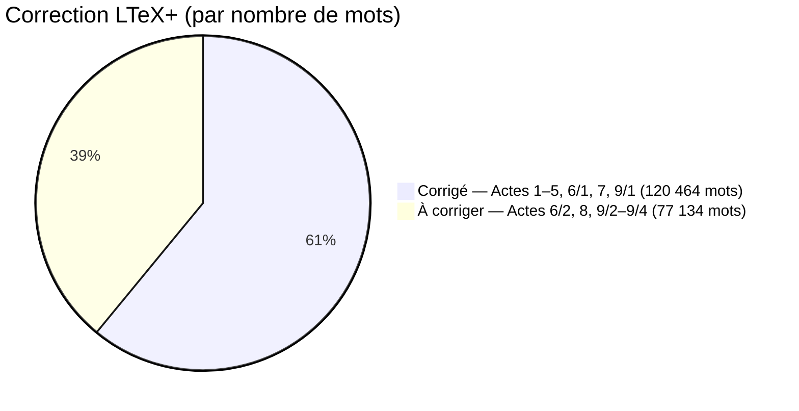

# Nombre de mots par acte

| Acte | Fichier | Mots | % du total | Corrigé | Diffs |
|------|---------|-----:|----------:|:-------:|------:|
| Acte 1 | acte_01.tex | 4 046 | 2,0 % | ☑ | 10 |
| Acte 2 | acte_02.tex | 17 790 | 9,0 % | ☑ | 83 |
| Acte 3 | acte_03.tex | 20 799 | 10,5 % | ☑ | 83 |
| Acte 4 | acte_04.tex | 20 454 | 10,3 % | ☑ | 62 |
| Acte 5 | acte_05.tex | 20 814 | 10,5 % | ☑ | 68 |
| Acte 6/1 | acte_06_1.tex | 22 360 | 11,3 % | ☑ | 52 * |
| Acte 6/2 | acte_06_2.tex | 10 520 | 5,3 % | ☐ |  |
| Acte 7 | acte_07.tex | 2 948 | 1,5 % | ☑ | 15 |
| Acte 8 | acte_08.tex | 17 228 | 8,7 % | ☐ | 21 |
| Acte 9/1 | acte_09_1.tex | 11 253 | 5,7 % | ☑ | 103 * |
| Acte 9/2 | acte_09_2.tex | 23 461 | 11,9 % | ☐ |  |
| Acte 9/3 | acte_09_3.tex | 19 858 | 10,0 % | ☐ |  |
| Acte 9/4 | acte_09_4.tex | 6 067 | 3,1 % | ☐ |  |
| **Total** | | **197 598** | **100 %** | | **497** |

> Décompte hors commandes LaTeX et commentaires.
> **Diffs** = nombre de blocs supprimés/remplacés (via `latexdiff`), hors bruit typographique (apostrophes, guillemets, tirets, etc.).
> `*` = diff calculé sur le groupe complet (6/1+6/2 ou 9/1+9/2+9/3+9/4) ; décompte par partie non disponible. Le total est affiché uniquement sur la première sous-partie du groupe.

## Avancement des corrections LTeX+

