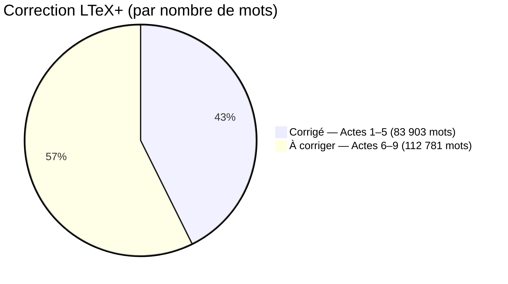

# Nombre de mots par acte

| Acte   | Fichier        | Mots   | % du total | Corrigé |
|--------|----------------|-------:|----------:|:-------:|
| Acte 1 | acte_01.tex    |  4 046 |      2,1 % | ☑ |
| Acte 2 | acte_02.tex    | 17 790 |      9,0 % | ☑ |
| Acte 3 | acte_03.tex    | 20 799 |     10,6 % | ☑ |
| Acte 4 | acte_04.tex    | 20 454 |     10,4 % | ☑ |
| Acte 5 | acte_05.tex    | 20 814 |     10,6 % | ☑ |
| Acte 6 | acte_06.tex    | 31 994 |     16,3 % | ☐ |
| Acte 7 | acte_07.tex    |  2 948 |      1,5 % | ☐ |
| Acte 8 | acte_08.tex    | 17 228 |      8,8 % | ☐ |
| Acte 9 | acte_09.tex    | 60 611 |     30,8 % | ☐ |
| **Total** |             | **196 684** | **100 %** | |

> Décompte hors commandes LaTeX et commentaires.

## Avancement des corrections LTeX+

