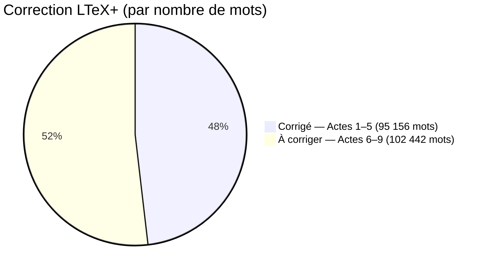

# Nombre de mots par acte

| Acte | Fichier | Mots | % du total | Corrigé | Diffs | Résumé |
|------|---------|-----:|----------:|:-------:|------:|--------|
| Acte 1 | acte_01.tex | 4 046 | 2,0 % | ☑ | 10 | Beauvais surprend Gulav Behram en plein cambriolage et le tue ; il met en scène sa mort au volant d'une voiture volée. |
| Acte 2 | acte_02.tex | 17 790 | 9,0 % | ☑ | 83 | Deux prêtres décapités, leur cerveau remplacé par des croquettes pour chien ; enquête sur plusieurs pistes avant de disculper le routier Dylan Passereau. |
| Acte 3 | acte_03.tex | 20 799 | 10,5 % | ☑ | 83 | Cadavres dans les bois et une fosse à purin ; l'interrogatoire brutal du raciste Cerqueira révèle le groupe extrémiste des « Disciples de la Colère ». |
| Acte 4 | acte_04.tex | 20 454 | 10,3 % | ☑ | 62 | L'équipe de justiciers (Djeferson, Titus, Greg, Maël, Samuel) prépare une opération contre des nazis ; ils embarquent Sally Robinson au Sugar & Spice. |
| Acte 5 | acte_05.tex | 20 814 | 10,5 % | ☑ | 68 | Départ pour la Namibie à la recherche de Titus enlevé par Atiena ; le Caribbean Hôtel refuse de coopérer. |
| Acte 6/1 | acte_06_1.tex | 22 360 | 11,3 % | ☐ | 52 * | L'opération avortée — Atiena, Gardienne de la Nuit, paralyse Sam ; Titus et la Gardienne disparaissent ; arrivée inattendue de la police. |
| Acte 6/2 | acte_06_2.tex | 10 520 | 5,3 % | ☐ | 52 * | Le brigadier-chef Lisnic et l'agent Achaari ; Sam revenu mais méconnaissable ; débâcle avec Sally Robinson ; plan de vengeance contre les Disciples de la Colère ; direction le Caribbean Hôtel. |
| Acte 7 | acte_07.tex | 2 948 | 1,5 % | ☑ | 15 | Retour au Caribbean Hôtel ; le portier refuse l'accès en invoquant l'embargo contre les Blancs et les pouvoirs surnaturels d'Atiena. |
| Acte 8 | acte_08.tex | 17 228 | 8,7 % | ☐ | 21 | De retour chez lui, Beauvais enquête sur le vol des livres rares de Jacquinot — des éditions originales des XVIIIe et XIXe siècles. |
| Acte 9/1 | acte_09_1.tex | 11 253 | 5,7 % | ☑ | 103 * | Réveil, appel avec Bérénice, trajet vers le Caribbean Hôtel. |
| Acte 9/2 | acte_09_2.tex | 23 461 | 11,9 % | ☐ | 103 * | Investigation à l'hôtel ; réceptionniste mystérieux Repentance Whittingham ; recherche de Titus. |
| Acte 9/3 | acte_09_3.tex | 19 858 | 10,0 % | ☐ | 103 * | Affaire Charrier : filature, confrontation, fusillade, mort. |
| Acte 9/4 | acte_09_4.tex | 6 067 | 3,1 % | ☐ | 103 * | Réflexions finales avec Greg ; mystères sans réponse sur Titus et Bérénice. |
| **Total** | | **197 598** | **100 %** | | **497** | |

> Décompte hors commandes LaTeX et commentaires.
> **Diffs** = nombre de blocs supprimés/remplacés (via `latexdiff`), hors bruit typographique (apostrophes, guillemets, tirets, etc.).
> `*` = diff calculé sur le groupe complet (6/1+6/2 ou 9/1+9/2+9/3+9/4) ; décompte par partie non disponible.

## Avancement des corrections LTeX+

