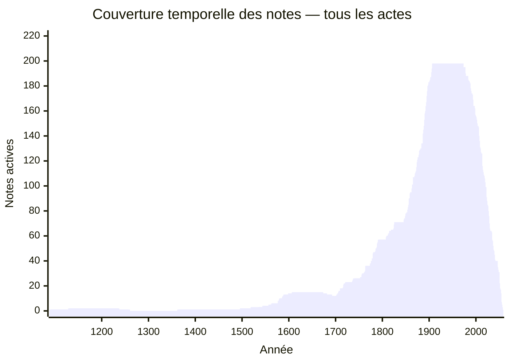

```mermaid
xychart-beta
    title "Couverture temporelle des notes — tous les actes"
    x-axis "Année" 1122 --> 2025
    y-axis "Notes actives" 0 --> 220
    bar [1, 1, 1, 1, 1, 1, 1, 1, 1, 1, 1, 1, 1, 1, 1, 1, 1, 1, 1, 1, 1, 1, 1, 1, 1, 1, 1, 1, 1, 1, 1, 1, 1, 1, 1, 1, 1, 1, 1, 1, 2, 2, 2, 2, 2, 2, 2, 2, 2, 2, 2, 2, 2, 2, 2, 2, 2, 2, 2, 2, 2, 2, 2, 2, 2, 2, 2, 2, 2, 2, 2, 2, 2, 2, 2, 2, 2, 2, 2, 2, 2, 2, 2, 1, 1, 1, 1, 1, 1, 1, 1, 1, 1, 1, 1, 1, 1, 1, 1, 1, 1, 1, 1, 1, 1, 1, 0, 0, 0, 0, 0, 0, 0, 0, 0, 0, 0, 0, 0, 0, 0, 0, 0, 0, 0, 0, 0, 0, 0, 0, 0, 0, 0, 0, 0, 0, 0, 0, 0, 0, 0, 0, 0, 0, 0, 0, 0, 0, 0, 0, 0, 0, 0, 0, 0, 0, 0, 0, 0, 0, 0, 0, 0, 0, 0, 0, 0, 0, 0, 0, 0, 0, 0, 0, 0, 0, 0, 0, 0, 0, 0, 0, 0, 0, 0, 0, 0, 0, 0, 0, 0, 0, 0, 0, 0, 0, 0, 0, 0, 0, 0, 0, 0, 0, 0, 0, 0, 0, 0, 0, 0, 0, 0, 0, 0, 0, 0, 0, 0, 0, 0, 0, 0, 0, 0, 0, 0, 0, 0, 0, 0, 0, 0, 0, 0, 0, 0, 0, 0, 0, 0, 0, 0, 0, 0, 0, 0, 0, 0, 0, 0, 0, 0, 0, 0, 0, 0, 0, 0, 0, 0, 0, 0, 0, 0, 0, 0, 0, 0, 0, 0, 0, 0, 1, 1, 1, 1, 1, 1, 1, 1, 1, 1, 1, 1, 1, 1, 1, 1, 1, 1, 1, 1, 1, 1, 1, 1, 1, 1, 1, 1, 1, 1, 1, 1, 1, 1, 1, 1, 1, 1, 1, 1, 1, 1, 1, 1, 1, 1, 1, 1, 1, 1, 1, 1, 1, 1, 1, 1, 1, 1, 1, 1, 1, 0, 0, 0, 0, 0, 0, 0, 0, 0, 0, 0, 0, 0, 0, 0, 0, 0, 0, 0, 0, 0, 0, 0, 0, 0, 0, 0, 0, 0, 0, 0, 0, 0, 0, 0, 0, 0, 0, 0, 0, 0, 0, 0, 0, 1, 1, 1, 1, 1, 1, 1, 1, 1, 1, 1, 1, 1, 1, 1, 1, 1, 1, 1, 1, 1, 1, 1, 1, 1, 1, 1, 1, 1, 2, 2, 2, 2, 2, 2, 2, 2, 2, 2, 2, 2, 2, 2, 2, 2, 2, 2, 2, 2, 2, 2, 2, 3, 3, 3, 2, 2, 2, 2, 1, 1, 1, 1, 1, 2, 2, 2, 3, 3, 3, 3, 3, 3, 3, 3, 3, 3, 4, 4, 4, 4, 4, 4, 4, 4, 4, 4, 4, 4, 4, 5, 5, 5, 5, 5, 5, 6, 5, 6, 6, 5, 5, 5, 5, 5, 5, 5, 5, 5, 5, 8, 8, 9, 10, 10, 10, 10, 9, 10, 11, 12, 12, 13, 13, 13, 13, 13, 13, 13, 13, 13, 13, 14, 14, 14, 14, 14, 14, 14, 14, 15, 14, 14, 14, 14, 14, 14, 14, 14, 13, 13, 12, 12, 12, 12, 12, 13, 13, 13, 13, 12, 12, 12, 12, 12, 12, 12, 11, 11, 11, 11, 10, 10, 9, 8, 8, 8, 8, 8, 10, 10, 9, 9, 7, 7, 7, 7, 5, 5, 5, 5, 4, 4, 4, 5, 6, 6, 5, 5, 5, 5, 5, 5, 5, 6, 5, 6, 6, 6, 6, 6, 7, 8, 9, 9, 9, 9, 10, 9, 9, 9, 9, 9, 9, 9, 9, 9, 9, 10, 10, 10, 10, 12, 12, 12, 13, 12, 14, 14, 15, 16, 16, 16, 18, 18, 18, 18, 18, 18, 19, 21, 22, 21, 22, 23, 22, 23, 23, 23, 23, 23, 22, 22, 22, 22, 22, 22, 22, 22, 24, 25, 26, 26, 26, 26, 26, 26, 25, 25, 23, 23, 23, 23, 24, 25, 25, 27, 27, 27, 29, 30, 30, 29, 29, 31, 30, 32, 36, 36, 36, 35, 35, 34, 35, 36, 35, 36, 38, 38, 40, 39, 42, 42, 46, 47, 46, 46, 47, 48, 50, 50, 51, 54, 55, 57, 57, 57, 55, 52, 53, 54, 53, 54, 52, 53, 53, 55, 53, 54, 56, 56, 59, 60, 60, 60, 61, 62, 62, 64, 61, 61, 64, 65, 64, 63, 65, 64, 66, 69, 71, 68, 68, 69, 67, 67, 67, 67, 68, 67, 67, 66, 66, 67, 67, 69, 69, 70, 69, 70, 73, 74, 74, 76, 78, 77, 79, 79, 81, 83, 85, 90, 90, 94, 95, 95, 94, 98, 101, 101, 107, 105, 105, 108, 110, 111, 112, 115, 119, 121, 123, 123, 125, 128, 129, 129, 130, 130, 134, 132, 134, 142, 145, 148, 153, 158, 160, 164, 167, 172, 176, 180, 181, 183, 182, 184, 185, 187, 185, 191, 194, 198, 194, 193, 195, 195, 190, 181, 184, 185, 184, 188, 185, 183, 184, 183, 182, 178, 176, 174, 174, 173, 169, 164, 163, 164, 162, 157, 156, 155, 153, 150, 148, 148, 147, 140, 136, 131, 130, 127, 125, 126, 116, 113, 111, 109, 108, 106, 103, 99, 99, 91, 88, 85, 84, 80, 76, 70, 66, 64, 64, 64, 63, 57, 56, 52, 49, 48, 45, 41, 40, 39, 37, 35, 40, 35, 33, 30, 31, 22, 18, 17, 14, 7, 5, 3, 1]
```

**446 plages temporelles** extraites de 16 actes.
**Pic :** 198 notes actives simultanées en 1940.